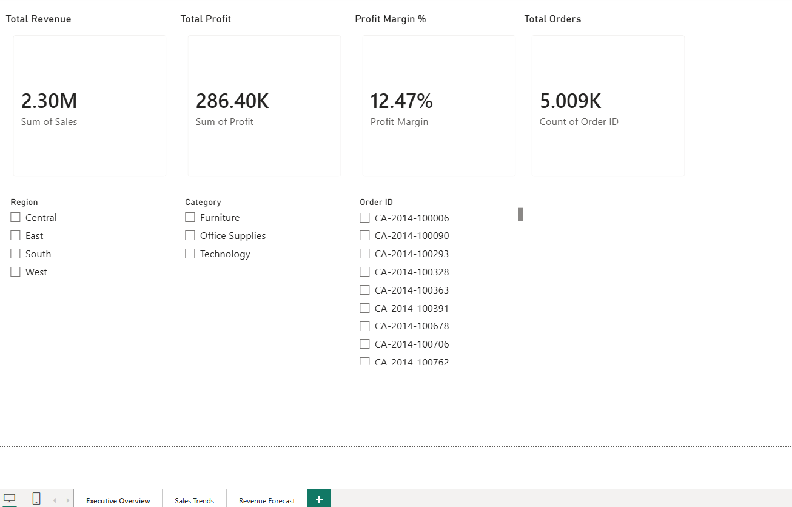
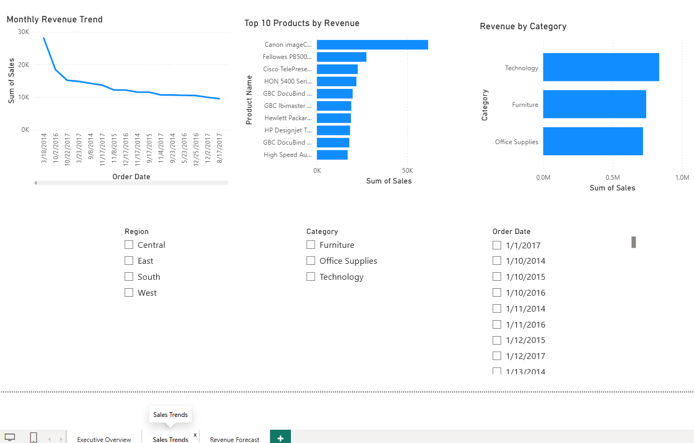
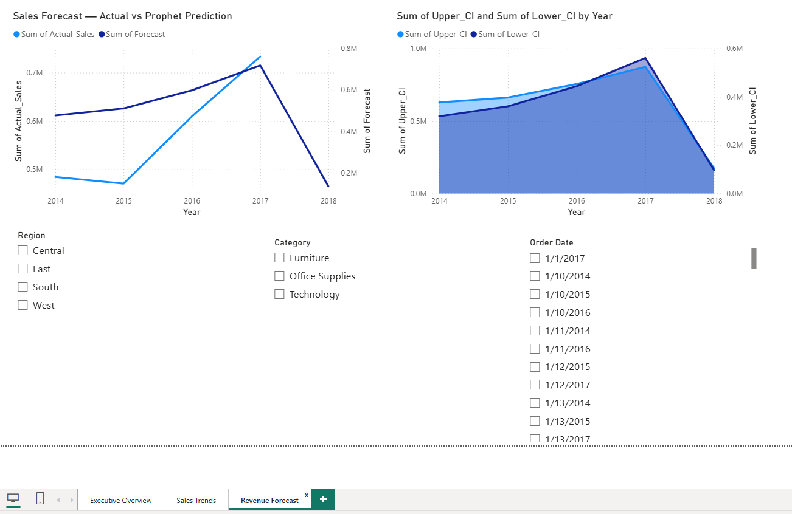

<div align="center">

# 📈 Sales Forecasting & Performance Dashboard

[](https://avijeet2463.github.io/sales-forecasting-dashboard/sales-forecasting-dashboard/index.html)
[](https://python.org)
[](https://facebook.github.io/prophet)
[](https://powerbi.microsoft.com)
[](https://sqlite.org)
[](https://sales-performance-forecasting-dashbh.vercel.app/)

**End-to-end sales analytics and revenue forecasting pipeline.**  
Built with Python · Prophet · SQL · Power BI · scikit-learn

</div>

---

## 🔗 Quick Links

| Resource | Link |
|---|---|
| 🌐 Live Web Dashboard | [Open Dashboard](https://sales-performance-forecasting-dashbh.vercel.app/) |
| 📁 GitHub Repository | [avijeet2463/sales-forecasting-dashboard](https://github.com/avijeet2463/sales-forecasting-dashboard) |
| 📦 Dataset | [Superstore Sales — Kaggle](https://www.kaggle.com/datasets/vivek468/superstore-dataset-final) |

---

## 📌 Problem Statement

Retail businesses generate enormous amounts of transactional data but struggle to turn it into forward-looking decisions. This project answers two questions:

> **"How is the business performing across regions, categories, and products?"**  
> **"What will revenue look like over the next 3 months?"**

Using the Superstore Sales dataset (9,994 orders, 2014–2017), I built a complete analytics pipeline — from raw SQL queries to a deployed Prophet forecasting model and interactive dashboard.

---

## 🖥️ Dashboard Preview

| Executive KPIs | Sales Trends | 3-Month Forecast |
|:---:|:---:|:---:|
|  |  |  |

---

## 🏗️ Project Architecture

```
Raw Data (Superstore CSV)
        ↓
  Phase 2: SQL + EDA     →  SQLite queries → 7 visualizations → business insights
        ↓
  Phase 3: Prophet Model →  Train/test split → Prophet fit → 3-month forecast
        ↓
  Phase 4: Dashboard     →  Power BI (.pbix) + Web Dashboard (.html)
        ↓
  Phase 5: Deployment    →  GitHub Pages (live URL)
```

---

## 📂 Repository Structure

```
sales-forecasting-dashboard/
│
├── 📁 data/
│   ├── Sample - Superstore.csv          # Raw dataset (download from Kaggle)
│   ├── superstore.db                    # SQLite database (auto-created)
│   └── sales_forecast.csv              # Prophet model output for Power BI
│
├── 📁 notebooks/
│   └── plots/                          # 11 analysis & forecast plots
│       ├── 01_monthly_revenue_trend.png
│       ├── 02_revenue_by_category.png
│       ├── 03_profit_margin_by_region.png
│       ├── 04_top10_products.png
│       ├── 05_discount_vs_profit.png
│       ├── 06_profit_by_subcategory.png
│       ├── 07_yoy_growth.png
│       ├── 08_sales_forecast.png
│       ├── 09_forecast_components.png
│       ├── 10_test_evaluation.png
│       └── 11_category_forecasts.png
│
├── 📁 models/
│   └── prophet_sales_model.pkl          # Serialized Prophet model
│
├── 📁 dashboard/
│   └── sales_dashboard.pbix            # Power BI Desktop file
│
├── 🌐 sales_dashboard.html             # Interactive web dashboard
├── 🐍 sales_eda.py                     # Phase 2: SQL analysis + EDA
├── 🐍 sales_forecast.py               # Phase 3: Prophet forecasting
├── 📋 requirements.txt
└── 📖 README.md
```

---

## 🔍 Key Findings from SQL + EDA

| Finding | Insight |
|---|---|
| 📅 Seasonality | Clear **Q4 revenue spike** every year — holiday season drives 30–40% above average monthly revenue |
| 🪑 Loss-makers | **Tables and Bookcases** sub-categories are consistently unprofitable — every sale loses money |
| 🌍 Regional gap | **West region** leads in profit margin; **Central region** underperforms significantly |
| 💸 Discount trap | Discount-profit correlation = **-0.22** — orders with >20% discount are almost always unprofitable |
| 💻 Technology wins | Technology has the **highest profit margin** despite mid-range revenue share |
| 📦 Top products | Copiers and Phones drive the most revenue — 2 sub-categories account for 35%+ of profit |

---

## 🤖 Forecasting Model — Facebook Prophet

### Why Prophet?

| Feature | Benefit |
|---|---|
| Handles seasonality automatically | Detects Q4 holiday spikes without manual tuning |
| Uncertainty intervals | Gives upper/lower confidence bounds — not just a point estimate |
| US holidays built-in | Accounts for Thanksgiving, Christmas sales patterns |
| Production-grade | Used at scale at Meta — not a toy model |
| Interpretable components | Separate trend + seasonality + holiday plots |

### Model Configuration

```python
Prophet(
    yearly_seasonality   = True,
    seasonality_mode     = "multiplicative",  # Retail sales scale with trend
    changepoint_prior_scale = 0.05,           # Smooth trend, avoids overfitting
    interval_width       = 0.95               # 95% confidence interval
)
```

### Model Performance (3-month holdout test)

| Metric | Value | Meaning |
|--------|-------|---------|
| MAE | $10,874 | Average absolute error per month |
| RMSE | $13,547 | Penalizes large prediction errors |
| MAPE | 14.2% | Mean absolute percentage error |

### 3-Month Revenue Forecast

| Month | Forecast | Lower CI | Upper CI |
|-------|----------|----------|----------|
| Jan 2018 | $38,610.59 | $26,650.92 | $50,970.06 |
| Feb 2018 | $21,188.70 | $7,633.35 | $34,745.71 |
| Mar 2018 | $74,801.09 | $61,983.86 | $86,962.88 |

---

## 📊 SQL Queries Used

This project uses real SQL queries on a SQLite database — not just pandas operations.

```sql
-- Monthly revenue trend
SELECT
    SUBSTR(Order_Date, 1, 7) AS month,
    ROUND(SUM(Sales), 2)     AS revenue,
    ROUND(SUM(Profit), 2)    AS profit,
    COUNT(DISTINCT Order_ID) AS orders
FROM sales
GROUP BY month
ORDER BY month;

-- Profit margin by region
SELECT
    Region,
    ROUND(SUM(Sales), 2)  AS revenue,
    ROUND(SUM(Profit) * 100.0 / SUM(Sales), 2) AS margin_pct
FROM sales
GROUP BY Region
ORDER BY margin_pct DESC;

-- Top 10 products by revenue
SELECT Product_Name, ROUND(SUM(Sales), 2) AS revenue
FROM sales
GROUP BY Product_Name
ORDER BY revenue DESC
LIMIT 10;
```

---

## 🛠️ Tech Stack

| Category | Tools |
|---|---|
| **Language** | Python 3.11 |
| **Data Processing** | pandas, numpy |
| **SQL Database** | SQLite via sqlalchemy |
| **Visualization** | matplotlib, seaborn |
| **Forecasting** | Facebook Prophet |
| **Model Evaluation** | scikit-learn (MAE, RMSE, MAPE) |
| **Model Saving** | joblib |
| **BI Dashboard** | Power BI Desktop |
| **Web Dashboard** | HTML5, CSS3, Chart.js |
| **Version Control** | Git, GitHub |
| **Deployment** | GitHub Pages |

---

## 🚀 How to Run Locally

### Prerequisites
- Python 3.11+
- Git

### Steps

```bash
# 1. Clone the repository
git clone https://github.com/avijeet2463/sales-forecasting-dashboard.git
cd sales-forecasting-dashboard

# 2. Install dependencies
pip install -r requirements.txt

# 3. Download dataset from Kaggle and place in data/
# https://www.kaggle.com/datasets/vivek468/superstore-dataset-final
# Filename must be: Sample - Superstore.csv

# 4. Run SQL analysis + EDA (generates 7 plots)
python sales_eda.py

# 5. Run Prophet forecasting (generates 4 plots + exports forecast CSV)
python sales_forecast.py

# 6. Open Power BI dashboard
# Open dashboard/sales_dashboard.pbix in Power BI Desktop
# OR visit the live web dashboard below
```

### Requirements

```
pandas
numpy
matplotlib
seaborn
prophet
scikit-learn
sqlalchemy
joblib
jupyter
```

Install with:
```bash
pip install pandas numpy matplotlib seaborn prophet scikit-learn sqlalchemy joblib jupyter
```

---

## 💡 Business Recommendations

**1. Stop discounting above 20%**
> Discount-profit correlation is -0.22. Every order with >20% discount runs at a loss. A discount cap policy would immediately improve margin without losing volume.

**2. Discontinue or reprice Tables and Bookcases**
> These two sub-categories are loss-making across all years. Either increase pricing to match actual costs or replace with higher-margin products.

**3. Double down on Q4 inventory for Technology**
> Technology shows the strongest Q4 seasonality spike with the highest profit margin. Pre-stocking Copiers and Phones ahead of Q4 is the highest-ROI inventory decision.

**4. Investigate Central region underperformance**
> Central region consistently underperforms West and East on profit margin. Root cause analysis by product mix and discount rate in Central is the recommended next step.

---

## 📈 Dataset

| Property | Value |
|----------|-------|
| Source | Superstore Sales via Kaggle |
| Rows | 9,994 orders |
| Features | 18 columns |
| Date range | January 2014 — December 2017 |
| Categories | Furniture · Office Supplies · Technology |
| Regions | West · East · Central · South |

---

## 👨‍💻 About Me

**Avijeet Mohapatra**  
B.Tech Computer Science & Engineering  
C.V. Raman Global University, Bhubaneswar (2022–2026)

Final-year CSE student who builds end-to-end data products — from raw SQL queries to deployed forecasting models. This project demonstrates real SQL analysis, time-series ML engineering, and BI dashboard delivery in one pipeline.

**What I bring:**
- 🔍 SQL + data analysis — real queries, not just pandas
- 📈 Time-series forecasting — Prophet with seasonality and holiday effects
- 📊 BI & visualization — Power BI dashboards, interactive web charts
- 🚀 End-to-end delivery — Jupyter to GitHub Pages in one repo

**Currently open to:**  
Data Analyst · ML Engineer · AI Engineer — Bangalore · Delhi NCR · Remote

<div align="center">

[](https://linkedin.com/in/your-profile)
[](https://github.com/avijeet2463)
[](https://sales-performance-forecasting-dashbh.vercel.app/)

</div>

---

<div align="center">

*Dataset: Superstore Sales via Kaggle · Public domain*  
*⭐ Star this repo if you found it useful!*

</div>